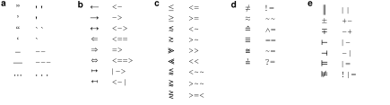
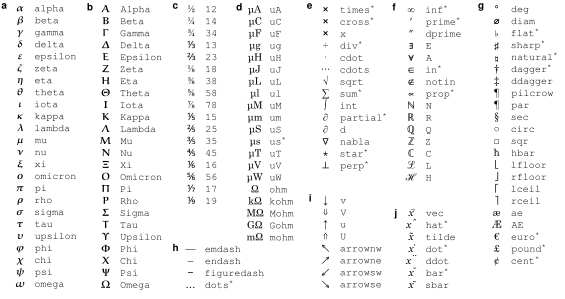

Formatting
==================

Inline with its mission, NotedELN only allows the most basic of
formatting options:

  Italics
    Press [Ctrl][I] or [Ctrl][/] to italicize the word under the cursor
    or the current selection (or to unitalicize).
  
  Bold face
  
    Press [Ctrl][B] or [Ctrl][\*] (or [Ctrl][8]) for bold face.
  
  Underscore
  
    Press [Ctrl][U] or [Ctrl][_] (underscore; on my keyboard:
    [Ctrl][Shift][-]) for underline.
  
  Subscripts and superscripts
  
    Press [Ctrl][^] (or [Ctrl][6]) to create a superscript and
    [Ctrl][-] (minus) to create a subscript. Superscripts and
    subscripts can also be created by typing [^] or [_] followed by
    the text of the superscript or subscript and then pressing
    [Ctrl][.] (period).

  Highlighting and crossing out

    Any text, old or new, can be highlighted using the |highlight|
    icon ([F7]) or crossed out using the |strikeout| icon
    ([F8]). These annotations can be removed using the |plain| icon
    ([F9]). Highlighting of the selection or word under the cursor can
    also be toggled using [Ctrl][!] (or [Ctrl][1]). Likewise,
    [Ctrl][=] toggles cross-out.

.. |highlight| image:: highlight.png
              :height: 3ex
              :class: no-scaled-link

.. |strikeout| image:: strikeout.png
              :height: 3ex
              :class: no-scaled-link
                      
.. |plain| image:: plain.png
              :height: 3ex
              :class: no-scaled-link

Characters that don't appear on your keyboard
---------------------------------------------

NotedELN supports most of unicode and—presumably—you can use any input
method supported by Qt to enter text [#f1]_. In addition, the
following substitutions are made automatically as you type:

See :ref:`codemode` for how to prevent these substitutions.)

   Automatic character substitutions. To get the glyph on the left,
   type the character sequence on the right. **a.** General
   punctuation. **b.** Arrows (see also below). **c.** Less than and
   greater than. **d.** Decorated equals signs. **e.** Other
   mathematical operators.

In addition to the automatic substitutions, there are many symbols
that can be obtained by typing a backslash followed by their name:

   Symbols that may be obtained by a TeX-like command. To get the
   symbols on the left, type a backslash followed by the character
   sequence on the right, then keep typing. **a, b.** Lowercase and
   uppercase Greek letters. **c.** Fractions. **d.** Scientific
   units. **e.** Mathematical operators. **f.** Other mathematical
   symbols. **g.** Other symbols. **h.** General punctuation. **i.**
   Arrows. **j.** Mathematical accents. (The accents differ from the
   other codes, in that the accent is placed over the preceding
   character rather than as a separate entity.)

Extending this list is easy, so let me know if you have suggestions.

As an alternative to standard unicode input methods for entering
accented letters, NotedELN supports creating a select group of
accented letters by typing a backslash followed by a symbol and a
letter, as in “Se\˜nor” for “Señor” or “gar\,con” for
“garçon”. Here is the full list:

.. figure:: accents.svg
   :width: 700px
   :align: center

   Accented letters that may be obtained by a TeX-like
   sequence. To get the accented letters on the left, type a backslash
   followed by the character sequence on the right, then keep typing.

Footnotes
---------

Press [Ctrl][N] to create a footnote. Footnotes are connected to the
main text by arbitrary tags: the word at the cursor becomes the
tag. If you prefer to use symbols to tag footnotes, the symbols *, †,
‡, §, ¶, and ♯ can be created by typing *, +, ++, $, @, and # before
pressing [Ctrl][N]. Footnotes are deleted by deleting the tag in the
main text or by pressing [Ctrl][Shift][N] while the tag is
highlighted.

If your tag is a big integer, it is interpreted as a PubMed ID. In
that case, NotedELN will insert the corresponding citation in the note
for you automatically. (If you have suggestions for other kinds of
automatically created note contents, I want to hear from you.)

Typesetting quotations, computer code, and other imported materials
----------------------------------------------------------------------

Occasionally it is useful to typeset “imported” materials such as
quotations differently from the rest of your notes. In a small
concession to typographic nicety, NotedELN does this for you if you
press [Ctrl][Tab]. The paragraph will be typeset in a slightly
different color, a slightly smaller point size, and with slightly
larger margins. To undo, simply press [Ctrl][Tab] again. Similarly,
indentation can be cycled between indented paragraphs (the default),
non-indented paragraphs, and “dedented” paragraphs, which is useful
for typing bullet lists. This is done by pressing [Shift][Tab].

Footnote
----------

.. [#f1] I have only tested this with
the “compose” key method in “Gnome”; I am interested in your test
results.   

