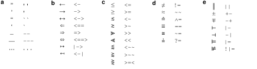
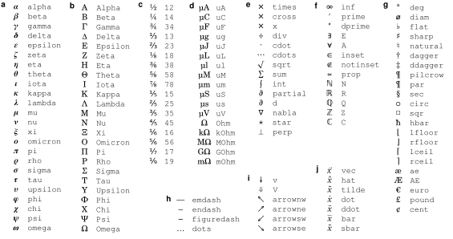
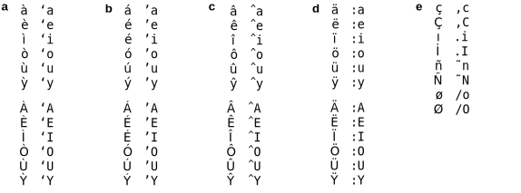
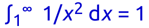
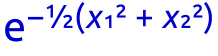

Typesetting math and computer code
==================================

Characters that don't appear on your keyboard
---------------------------------------------

NotedELN supports most of unicode and—presumably—you can use any input
method supported by Qt to enter text [#f1]_. But the options for your
operating system may not be that well documented. Therefore, NotedELN
tries to make it easy for you.

Automatic character substitutions
^^^^^^^^^^^^^^^^^^^^^^^^^^^^^^^^^

The following substitutions are made automatically as you type:

To get one of the glyph on the left, type the character sequence to its right.
(See
:ref:`codemode` for how to prevent these substitutions if they get in
your way.)   

TeX-like substitutions
^^^^^^^^^^^^^^^^^^^^^^^^^
   
In addition to the automatic substitutions, there are many symbols
that can be obtained by typing a backslash followed by their name:

To get on of the symbols on the left, type a backslash followed by the
character sequence to its right, then keep typing. (The accents
(**j**) differ from the other codes, in that the accent is placed over
the preceding character rather than as a separate entity.)

Extending this list is easy, so let me know if you have suggestions.

Accented letters
^^^^^^^^^^^^^^^^

As an alternative to standard unicode input methods for entering
accented letters, NotedELN supports creating a select group of
accented letters by typing a backslash followed by a symbol and a
letter, as in “Se\\˜nor” for “Señor” or “gar\\,con” for
“garçon”. Here is the full list:

To get one the accented letters on the left, type a backslash followed by
the character sequence to its right, then keep typing.

Typesetting equations
---------------------

When typing mathematical equations, having to frequently type the
backslash for special characters and [Ctrl][/] for italics can get
tiresome. To avoid this annoyance, press [Ctrl][‘] (that’s the key to
the left of the [1] on many qwerty keyboards) to enter (and exit)
“math” mode, which turns the |type| icon into |type-math|. (Math mode
can also be entered by double-clicking the |type| icon or pressing
[Shift][F2].)

.. |type| image:: type.png
              :height: 3ex
              :class: no-scaled-link                   

.. |type-math| image:: type-math.png
              :height: 3ex
              :class: no-scaled-link

In math mode, special characters can be entered simply by typing their
name and single-character words are typeset in italics [#f2]_. To
typeset a single-letter variable name in bold, bold italic, or roman,
type its letter multiple times. Also in math mode, simple subscripts
and superscripts can be typeset by just typing underscore or hat
followed by the text of the sub- or superscript. A space, or
punctuation followed by a space, ends the subscript or superscript. As
a result, an equation like |eqn1| can be typeset simply by typing
“int_1^inf 1/x^2 dx = 1” [#f3]_.

Even double superscripts and subscripts are possible, to the degree
that the second level is supported by unicode [#f4]_. For instance,
|eqn2| can be typeset simply by typing
“e^{-\\12 (x_1^2 + x_2^2)}”. (Note how the curly braces temporarily
“protect” the inner expression.)

.. _codemode:

Typesetting computer code
--------------------------

When typing computer code, the automatic character substitions can be a
hindrance. To disable all automatic substitions, press [Ctrl][F2] (or
click the |type| icon with [Ctrl] held). The icon will change to
|type-code|, which signifies “Code” mode. Press [F2] to return to
normal text mode.

.. |type-code| image:: type-code.png
              :height: 3ex
              :class: no-scaled-link

Footnote
----------

.. [#f1] I have only tested this with the “compose” key method in
   “Gnome”; I am interested in your test results.

.. [#f2] A few exceptions apply: Without a preceding backslash, “x”
  does not generate ×, “d” does not generate ∂, and symbols whose
  commands are plain English words (e.g., “sum”) also still require
  typing the backslash.  NotedELN tries to guess whether you mean the
  variables a and I or the words “a” and “I.” A few other subtle cases
  are handled semi-intelligently as well.

.. [#f3] I'll be the first to admit that mathematics typeset by LaTeX
         looks much nicer, but then again, at least in my opinion,
         using LaTeX for daily note taking would take real dedication.
  
.. [#f4] At last check, that support is limited to digits,
  parentheses, and the plus, minus, and equal signs. Results may also
  vary by font.
